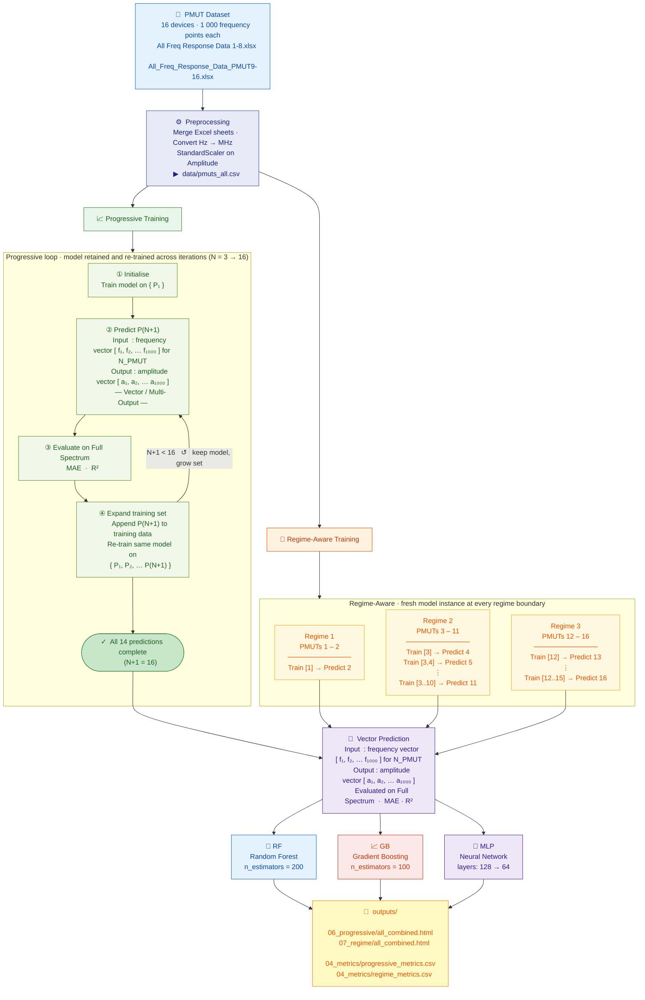

# PMUT Frequency Response Prediction — Experiment Flowchart



---

## What the diagram shows

```
Data
 └── Preprocessing
       ├── Progressive Training
       │     └── LOOP ↺ (model retained, training set grows each step)
       │           ①  Train on {P1}
       │           ②  Predict P(N+1)
       │           ③  Evaluate  MAE · R²
       │           ④  Append P(N+1), re-train  →  back to ② if N+1 < 16
       │           Done (N=16) ──────────────────────────────┐
       │                                                      │
       └── Regime-Aware Training                             │
             ├─ [Regime 1: PMUTs 1–2 ] ─────────────────────┤
             ├─ [Regime 2: PMUTs 3–11] ─────────────────────┤
             └─ [Regime 3: PMUTs 12–16] ────────────────────┤
                                                             ▼
                          🔷  Vector Prediction
                          Input : freq vector [f₁…f₁₀₀₀] for N_PMUT
                          Output: amplitude vector [a₁…a₁₀₀₀]
                                        │
                          ┌─────────────┼─────────────┐
                          ▼             ▼             ▼
                       🌲 RF         📈 GB         🧠 MLP
                                        │
                                       OUT
```

## Colour key

| Colour | Meaning |
|--------|---------|
| 🔵 Blue | Dataset |
| 🟣 Indigo | Preprocessing |
| 🟢 Green | Progressive Training header + loop nodes |
| 🟠 Orange | Regime-Aware Training header + regime blocks |
| 💜 Purple | Shared Vector Prediction block |
| 🔵 Light blue | RF model |
| 🔴 Coral | GB model |
| 💜 Lavender | MLP model |
| 🟡 Yellow | Output files |
